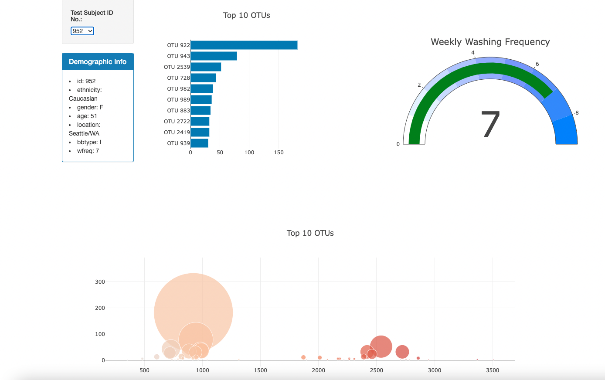

# Belly Button Biodiversity Dashboard

## Background
In this project, I create an interactive dashboard to explore the Belly Button Biodiversity dataset. This dataset catalogs the microbes colonizing human navels and reveals that a small handful of microbial species (also called operational taxonomic units, or OTUs) are present in more than 70% of people, while the rest are relatively rare.

### Assignment Summary
I used the D3 library to read in `samples.json` from the URL:
`https://2u-data-curriculum-team.s3.amazonaws.com/dataviz-classroom/v1.1/14-Interactive-Web-Visualizations/02-Homework/samples.json`.

From this data I subseqeuntly created multiple charts that show the most common microbial samples present in individuals as well as the individuals personal charachteristics. 

## App and Dashboard
Deploy your app to a free static page hosting service, such as GitHub Pages. 
